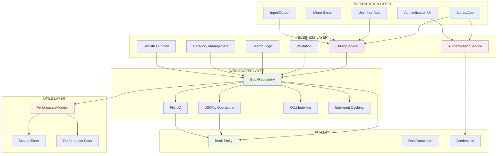
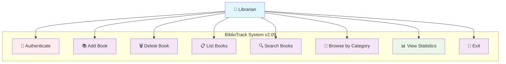
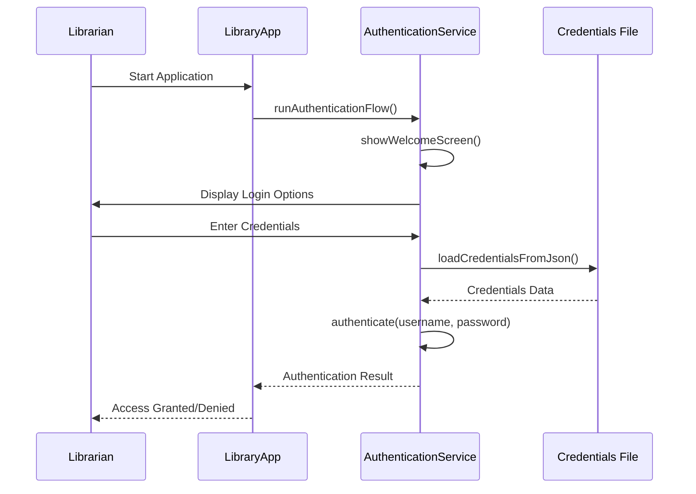
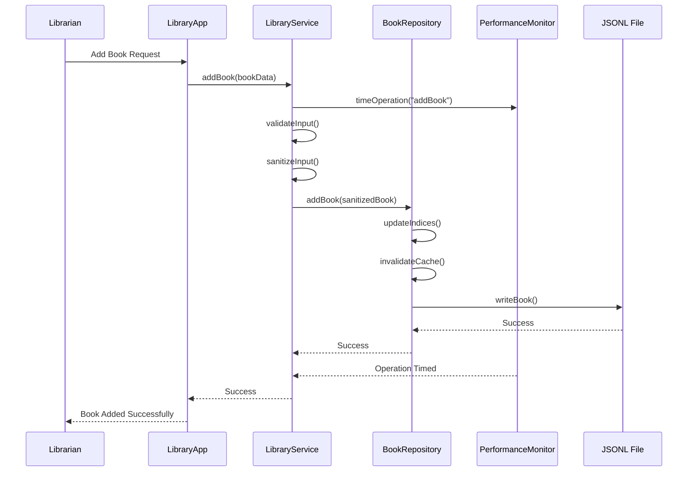
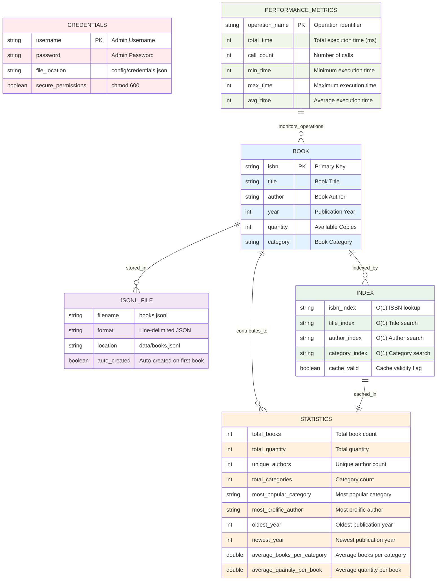

# BiblioTrack - Secure Library Management System (v2.09)

A comprehensive, enterprise-grade C++ library management system with secure authentication, advanced performance optimizations, and intelligent analytics. Built with clean architecture principles, featuring O(1) indexing, comprehensive testing suites, and real-time statistics dashboard.

## Project Resources

### Implementation & Planning
- **[Implementation Plan](./bibliotrack-plan.md)** - Complete 1-month implementation roadmap from v1.0 to v2.09

### Legal & Licensing
- **[LICENSE](LICENSE)** - MIT License - See license terms and conditions

## Features

### Core Library Management
- ✅ Add new books with ISBN, title, author, year, quantity, and category
- ✅ Delete books by ISBN with confirmation
- ✅ List all books in a formatted table with category display
- ✅ Advanced search capabilities (ISBN, title, author, category)
- ✅ Browse books by category with filtering options
- ✅ View comprehensive category statistics and distribution

### Advanced Features (v2.08+)
- ✅ Real-time statistics dashboard with analytics
- ✅ Collection overview (total books, quantity, authors, categories)
- ✅ Category analytics (most popular, quantity distribution)
- ✅ Author analytics (most prolific authors, top contributors)
- ✅ Publication analytics (year ranges, decade distribution, trends)
- ✅ Performance metrics and collection insights

### Performance & Optimization (v2.09)
- ✅ O(1) indexing for title, author, and category searches
- ✅ Intelligent caching with automatic cache invalidation
- ✅ Move semantics for optimized string operations
- ✅ Memory efficiency with pre-allocated containers
- ✅ Built-in performance monitoring utilities
- ✅ Advanced algorithm optimizations (O(n²) → O(n))

### Security & Authentication (v2.06+)
- ✅ Secure user authentication system with credential storage
- ✅ Enterprise-grade security with config directory isolation
- ✅ File permissions and git protection
- ✅ Template-based credential management
- ✅ Multiple login attempts with clear feedback

### Data Management
- ✅ JSONL file persistence (line-delimited) with automatic creation
- ✅ Input validation and sanitization
- ✅ Data integrity with robust error handling
- ✅ Special character handling and JSON escaping
- ✅ Cross-session data persistence

### Testing & Quality Assurance
- ✅ Comprehensive unit testing suite (15+ test categories)
- ✅ Integration testing for component interactions
- ✅ Smoke testing for end-to-end workflows
- ✅ Performance testing with large datasets (1000+ books)
- ✅ Automated test runner with detailed reporting

## Layered Architecture

The project follows Clean Architecture principles with four distinct layers:

### 📊 **DataModel Layer** (`src/datamodel/`)
Contains the core data structures and entities.
- `Book.hpp` - Book entity with optimized constructors, move semantics, and comprehensive property management

### 🔧 **Services Layer** (`src/services/`)
Contains business logic, data access, and security components.
- `BookRepository.*` - Advanced data persistence with O(1) indexing, intelligent caching, and JSONL operations
- `LibraryService.*` - Business logic, validation, search operations, and comprehensive statistics engine
- `AuthenticationService.*` - Complete authentication flow with secure credential management and user interaction

### 🛠️ **Utils Layer** (`src/utils/`)
Contains utility components and performance monitoring.
- `PerformanceMonitor.*` - Built-in performance measurement utilities with automatic timing and statistics

### 🚀 **Launcher Layer** (`src/launcher/`)
Contains the presentation layer and application entry point.
- `LibraryApp.*` - User interface and menu system with statistics dashboard and authentication integration
- `main.cpp` - Application entry point with proper initialization

## Project Structure

```
BiblioTrack/
├── src/
│   ├── datamodel/
│   │   └── Book.hpp              # Book entity with move semantics
│   ├── services/
│   │   ├── AuthenticationService.* # Secure authentication layer
│   │   ├── BookRepository.*      # Advanced data access with O(1) indexing
│   │   └── LibraryService.*      # Business logic and statistics engine
│   ├── utils/
│   │   └── PerformanceMonitor.*  # Performance monitoring utilities
│   └── launcher/
│       ├── LibraryApp.*          # User interface and menu system
│       └── main.cpp              # Application entry point
├── tests/
│   ├── UnitTests.cpp             # Comprehensive unit testing suite
│   ├── IntegrationTests.cpp      # Component interaction testing
│   ├── SmokeTests.cpp            # End-to-end functionality tests
│   ├── PerformanceTests.cpp      # Performance and optimization tests
│   ├── TestRunner.cpp            # Automated test runner
│   └── README_Tests.md           # Testing documentation
├── reports/
│   ├── BiblioTrack_Technical_Report.md # Technical documentation
│   ├── diagrams/                 # Architecture and sequence diagrams
│   └── README_Technical_Report.md # Documentation guide
├── config/                        # 🔐 SECURE CONFIGURATION
│   └── credentials_template.json # Template for admin credentials
├── data/
│   └── books.jsonl               # JSONL data storage (auto-created)
├── cmake-build-debug/            # Build directory (auto-created)
└── CMakeLists.txt                # Build configuration
```

## Quick Start

### Prerequisites
- **C++17** compatible compiler (GCC 7+, Clang 5+, MSVC 2017+)
- **CMake 3.12+**
- **Git** for version control

### Build Instructions

#### Windows (Visual Studio)
```bash
mkdir build && cd build
cmake .. -G "Visual Studio 16 2019"
cmake --build . --config Release
```

#### Windows (MinGW)
```bash
mkdir build && cd build
cmake .. -G "MinGW Makefiles"
cmake --build .
```

#### macOS (Xcode)
```bash
mkdir build && cd build
cmake .. -G Xcode
cmake --build . --config Release
```

#### macOS/Linux (Make)
```bash
mkdir build && cd build
cmake ..
make -j$(nproc)
```

### Running the Application

1. **First Run Setup:**
```bash
   cd build
   ./BiblioTrack
   ```

2. **Authentication:**
   - Default credentials: `admin` / `admin123`
   - Credentials stored in `config/credentials.json`

3. **Menu Options:**
   ```
   === BiblioTrack v2.09 - Library Management System ===
   1. Add Book
   2. Delete Book
   3. List Books
   4. Search Books
   5. Browse by Category
   6. View Statistics
   7. Exit
   ```

## Data Storage

### JSONL Format
Books are stored in `data/books.jsonl` using line-delimited JSON:
```json
{"isbn":"9780134685991","title":"Effective Modern C++","author":"Scott Meyers","year":2014,"quantity":5,"category":"Programming"}
{"isbn":"9780201633610","title":"Design Patterns","author":"Gang of Four","year":1994,"quantity":3,"category":"Programming"}
```

### Automatic File Creation
- `data/books.jsonl` - Created automatically on first book addition
- `config/credentials.json` - Created from template on first run

## Security

### Authentication System
- **Secure Storage:** Credentials isolated in `config/` directory
- **File Permissions:** `chmod 600` for credential files
- **Git Protection:** Credential files excluded from version control
- **Template System:** `credentials_template.json` for easy setup

### Setup Credentials
1. Copy `config/credentials_template.json` to `config/credentials.json`
2. Update with your credentials
3. Set secure permissions: `chmod 600 config/credentials.json`

## Performance Features

### O(1) Indexing System
- **ISBN Index:** Direct hash-based lookup
- **Title Index:** Multi-value hash mapping
- **Author Index:** Multi-value hash mapping  
- **Category Index:** Multi-value hash mapping

### Intelligent Caching
- **Statistics Cache:** Pre-computed analytics with automatic invalidation
- **Memory Optimization:** Pre-allocated containers and move semantics
- **Performance Monitoring:** Built-in timing and metrics collection

## Testing

### Running Tests
```bash
cd build
./TestRunner                    # Run all tests
./TestRunner --list            # List available tests
./TestRunner --unit            # Run unit tests only
./TestRunner --integration     # Run integration tests only
./TestRunner --smoke           # Run smoke tests only
./TestRunner --performance     # Run performance tests only
```

### Test Coverage
- **Unit Tests:** 15+ test categories covering all components
- **Integration Tests:** Component interaction scenarios
- **Smoke Tests:** End-to-end workflow validation
- **Performance Tests:** Large dataset handling (1000+ books)

## Version History

### Current Release (v2.09)
- **Advanced Algorithm Optimization:** O(1) indexing for title, author, and category searches
- **Intelligent Caching:** Pre-computed statistics with automatic cache invalidation
- **Move Semantics:** Optimized string operations and memory management
- **Performance Monitoring:** Built-in timing utilities with comprehensive metrics
- **JSONL Standardization:** Line-delimited JSON format for efficient storage
- **Enhanced Testing:** 5 comprehensive test suites with automated runner

### Previous Releases
- **v2.08:** Statistics dashboard release - Comprehensive library analytics, collection insights, and performance metrics
- **v2.07:** Performance optimization release - O(n²) → O(n) algorithms, memory optimization, enhanced testing
- **v2.06:** Security release - Secure authentication system with config directory isolation and enterprise-grade security
- **v2.05:** JSON migration - Storage format migration from CSV to JSON with in-memory caching
- **v2.04:** Enhanced CSV handling, input sanitization, and data reliability improvements
- **v2.03:** Cross-platform compatibility, C++17 year validation, and build system updates
- **v2.02:** UI/UX improvements with better menu layout and formatted displays
- **v2.01:** ISBN validation, persistence improvements, and confirmation dialogs
- **v2.00:** Architecture refactoring with clean layer separation

### Legacy Versions
- **v1.01:** Fixed bugs when adding new book & saving the data on CSV file
- **v1.0:** Initial release with CSV storage, basic CRUD operations, and clean architecture foundation

## Design Principles

### Clean Architecture
- **Separation of Concerns:** Each layer has distinct responsibilities
- **Dependency Inversion:** High-level modules don't depend on low-level modules
- **Single Responsibility:** Each class has one reason to change
- **Open/Closed:** Open for extension, closed for modification

### SOLID Principles
- **S** - Single Responsibility Principle
- **O** - Open/Closed Principle  
- **L** - Liskov Substitution Principle
- **I** - Interface Segregation Principle
- **D** - Dependency Inversion Principle

### Performance Optimization
- **O(1) Operations:** Hash-based indexing for optimal search performance
- **Memory Efficiency:** Move semantics and pre-allocated containers
- **Intelligent Caching:** Pre-computed results with automatic invalidation
- **Algorithm Optimization:** O(n²) → O(n) improvements in critical paths

## Contributing

### Development Workflow
1. Fork the repository
2. Create a feature branch from `v2.09`
3. Implement changes with tests
4. Run full test suite
5. Submit pull request

### Code Standards
- **C++17** standard compliance
- **Clean Architecture** principles
- **Comprehensive Testing** for all new features
- **Documentation** updates for significant changes

## License

This project is licensed under the MIT License - see the [LICENSE](LICENSE) file for details.

## Architecture Diagrams

### System Architecture Overview



### Use Case Diagram



### Authentication Sequence



### Add Book Sequence (v2.09)



### Entity Relationship Diagram



### Additional Documentation
- **[Complete Technical Report](reports/BiblioTrack_Technical_Report.md)** - Comprehensive technical documentation
- **[Testing Documentation](tests/README_Tests.md)** - Complete testing guide and coverage
- **[All Sequence Diagrams](reports/diagrams/sequence_diagrams.md)** - Complete system workflows
- **[Architecture Details](reports/diagrams/architecture_diagram.md)** - Detailed architecture diagrams

## Acknowledgments

### Development Team
- **Bilal RAHAOUI** - Core Developer & Project Lead
- **Mohamed KADDOUR** - Core Development & Performance Optimization
- **Ali MANSOOR** - Testing & Documentation

### Project Credits
- Built with modern C++17 features and best practices
- Inspired by Clean Architecture principles
- Designed for educational and professional use
- Comprehensive testing and documentation approach

